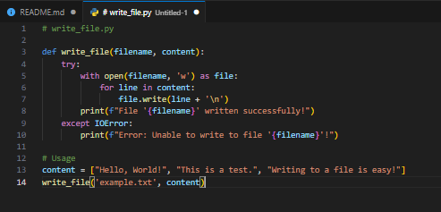

# SE-Assignment-6
 Assignment: Introduction to Python
Instructions:
Answer the following questions based on your understanding of Python programming. Provide detailed explanations and examples where appropriate.

 Questions:

1. Python Basics:
   - What is Python, and what are some of its key features that make it popular among developers? Provide examples of use cases where Python is particularly effective.

   - Python is a user-friendly programming language that doesn't require compilation. It's commonly used for tasks like building websites, working with scientific data, analyzing information, developing artificial intelligence, and more. Python was developed by Guido van Rossum in the late 1980s and made available to the public in 1991.

   - Python has gained immense popularity due to its simplicity, adaptability, and versatility. As a language, it is applicable across various use cases, extending from straightforward scripting jobs to intricate enterprise-level projects.

   Here's an example of Python code that uses the pandas library to analyze a CSV file:

   

2. Installing Python:
   - Describe the steps to install Python on your operating system (Windows, macOS, or Linux). Include how to verify the installation and set up a virtual environment.
**Step 1: Download the Python Installer**

1.  Go to the official Python download page: [https://www.python.org/downloads/](https://www.python.org/downloads/)
    
2.  Click on the "Download Python" button.
    
3.  Select the Windows installer (e.g., "Python 3.9.5 (64-bit) Installer") and click on the download link.
    
4.  Save the installer file (e.g., **python-3.9.5-amd64.exe**) to your computer.
    

**Step 2: Run the Installer**

1.  Run the installer file by double-clicking on it.
    
2.  Follow the installation wizard's instructions:
    
    *   Select the installation location (e.g., **C:\\Python39**).
        
    *   Choose whether to install Python for all users or just the current user.
        
    *   Select the components to install (e.g., Python, pip, IDLE, etc.).
        
    *   Choose whether to add Python to your PATH environment variable (recommended).
        
3.  Click "Install" to begin the installation process.
    

**Step 3: Verify the Installation**

1.  Open a new Command Prompt or PowerShell window.
    
2.  Type **python --version** and press Enter.
    
3.  You should see the version of Python you just installed (e.g., **Python 3.9.5**).
    
4.  Type **python** and press Enter to open the Python interpreter.
    
5.  You should see the Python prompt (**\>>>**) indicating that Python is installed correctly.
    

**Step 4: Set up a Virtual Environment**

A virtual environment is a self-contained Python environment that allows you to isolate dependencies and packages for a specific project.

1.  Open a new Command Prompt or PowerShell window.
    
2.  Install the **virtualenv** package by running **pip install virtualenv**.
    
3.  Create a new virtual environment by running **virtualenv myenv** (replace **myenv** with your desired environment name).
    
4.  Activate the virtual environment by running **myenv\\Scripts\\activate** (on Windows) or **source myenv/bin/activate** (on Linux/macOS).
    
5.  You should see the name of the virtual environment in your command prompt or terminal.
    
6.  Install packages specific to your project using **pip** (e.g., **pip install requests**).
    
7.  When you're done working on your project, deactivate the virtual environment by running **deactivate**.

3. Python Syntax and Semantics:
   - Write a simple Python program that prints "Hello, World!" to the console. Explain the basic syntax elements used in the program.

Let's break down the basic syntax elements used in this program:

1.  **Indentation**: In Python, indentation is used to denote block-level structure. However, in this simple program, there is no block-level structure, so there is no indentation.
    
2.  **print() function**: The **print()** function is a built-in Python function that prints its argument to the console. It's a function, so it's followed by parentheses **()**.
    
3.  **String literal**: The string **"Hello, World!"** is a string literal, which is a sequence of characters enclosed in quotes. In Python, strings can be enclosed in single quotes **'** or double quotes **"** (but not both).
    
4.  **Argument**: The string **"Hello, World!"** is passed as an argument to the **print()** function. In Python, arguments are separated by commas **,**.
    

That's it! This program is a single statement that calls the **print()** function with a string argument.

4. Data Types and Variables:
   - List and describe the basic data types in Python. Write a short script that demonstrates how to create and use variables of different data types.

**1\. Integers (int)**: Whole numbers, either positive, negative, or zero.

**2\. Floats (float)**: Decimal numbers, either positive, negative, or zero.

**3\. Strings (str)**: Sequences of characters, such as words, phrases, or sentences. Strings can be enclosed in single quotes **'** or double quotes **"**.

**4\. Boolean (bool)**: Values that can be either **True** or **False**.

**5\. List (list)**: Ordered collections of values, which can be of any data type, including strings, integers, floats, and other lists.

**6\. Tuple (tuple)**: Ordered, immutable collections of values, which can be of any data type.

**7\. NoneType (None)**: A special value that represents the absence of a value.

5. Control Structures:
   - Explain the use of conditional statements and loops in Python. Provide examples of an `if-else` statement and a `for` loop.
1.  **if statement**: Executes a block of code if a certain condition is true.
    
2.  **if-else statement**: Executes a block of code if a certain condition is true, and another block of code if the condition is false.
    
3.  **elif statement**: Used to check multiple conditions and execute a block of code if any of the conditions are true.

6. Functions in Python:
   - What are functions in Python, and why are they useful? Write a Python function that takes two arguments and returns their sum. Include an example of how to call this function.

Python functions allow you to bundle related code into reusable blocks. These blocks can be run as many times as needed from anywhere in your program. They make it convenient to organize code and execute specific actions easily.

Example: A Python function that takes two arguments and returns their sum

Example of how to call this function

7. Lists and Dictionaries:
   - Describe the differences between lists and dictionaries in Python. Write a script that creates a list of numbers and a dictionary with some key-value pairs, then demonstrates basic operations on both.
  
   In Python, **lists** and **dictionaries** are two fundamental data structures that serve different purposes.

   Script demonstrating basic operations on lists and dictionaries

   

   Output:

   

8. Exception Handling:
   - What is exception handling in Python? Provide an example of how to use `try`, `except`, and `finally` blocks to handle errors in a Python script.

In Python, **exception handling** is a mechanism to handle runtime errors or exceptions that occur during the execution of a program. It allows you to anticipate and recover from errors, making your code more robust and reliable.

9. Modules and Packages:
   - Explain the concepts of modules and packages in Python. How can you import and use a module in your script? Provide an example using the `math` module.
**Modules and Packages in Python**

In Python, **modules** and **packages** are ways to organize and reuse code.

**Modules**

A **module** is a single file that contains a collection of related functions, classes, and variables. Modules are essentially libraries of code that can be imported and used in other Python scripts. Modules can be:

1.  **Built-in**: Provided by Python itself, such as **math** or **string**.
    
2.  **External**: Installed using pip or other package managers, such as **requests** or **numpy**.
    
3.  **Custom**: Created by you or your organization, such as a module for a specific project.

10. File I/O:
    - How do you read from and write to files in Python? Write a script that reads the content of a file and prints it to the console, and another script that writes a list of strings to a file.
 
  To read from a file in Python, you can use the **open()** function to open the file in read mode (**'r'**) and then use the **read()** method to read the contents of the file.

example script that reads the content of a file and prints it to the console:

Here's an example script that writes a list of strings to a file:

# Submission Guidelines:
- Your answers should be well-structured, concise, and to the point.
- Provide code snippets or complete scripts where applicable.
- Cite any references or sources you use in your answers.
- Submit your completed assignment by [due date].

